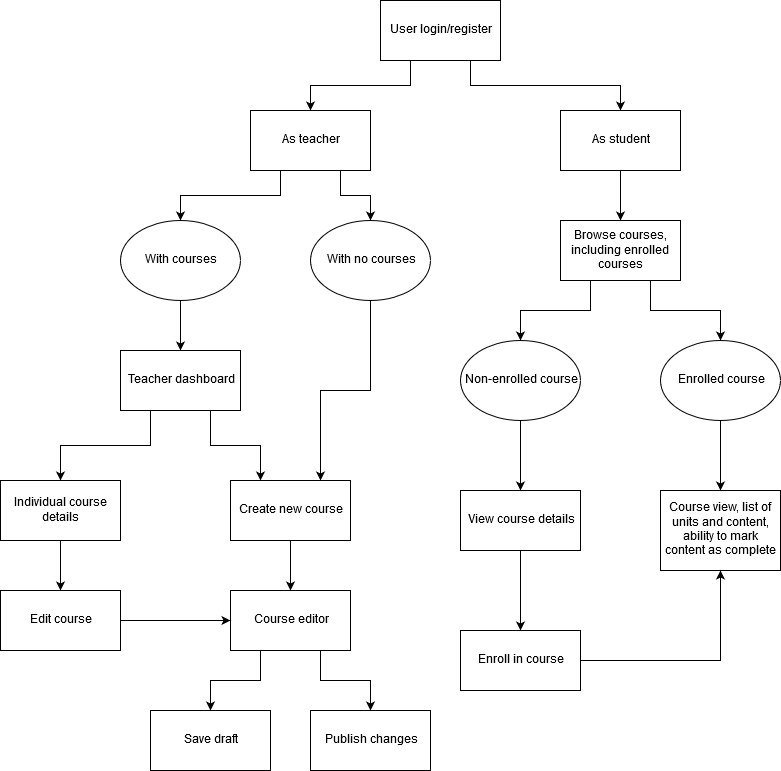

# Capstone Project 2 Proposal - Udemy-inspired LMS

## 1. What tech stack will you use for your final project? 

The application will make use of React. I'd also like to try using something like Firebase as a learning experience.

## 2. Is the front-end UI or the back-end going to be the focus of your project? Or are you going to make an evenly focused full-stack application?

Assuming most of the backend logic will be handled by Firebase, the project will primarily focus on the front end.

## 3. Will this be a website? A mobile app? Something else?

This will be a website.

## 4. What goal will your project be designed to achieve?

It will be a platform for creating and sharing e-learning courses on a variety of topics.

## 5. What kind of users will visit your app?

Both people looking to learn a new skill and teachers looking for a place to teach those skills.

## 6. What data do you plan on using? How are you planning on collecting your data?

The data will primarily be user-generated content. I can't think of any uses for external data in this particular app, aside from potentially recommending courses based on in-demand skills.

## 7. Project Outline

### a. What does your database schema look like?

In-depth design will wait until I've learned how to use Cloud Firestore, but a relational version would more or less look like this:
- Users - typical user data + optional demographic data + user role (creator/student)
- User enrollments - M:N association between users and courses
- Courses - Metadata related to course, including creation date, last updated date, course creator, description
- Course category - M:N assocation between course and category
- Unit - related to course and subunit
- Subunit - related to unit and course content
- Course content - A piece of content attached to a subunit, with a title, summary text, and some kind of resource(s) (video, article, text, etc.)

### b. What kinds of issues might you run into with your API?

Not applicable to an API, since I don't plan on using one, but I'm likely to run into issues with Firebase due to lack of experience.

### c. Is there any sensitive information you need to secure?

User auth data and demographic data

### d. What functionality will your app include?

Creators will be able to author courses and publish courses relatively easily. Ideally they'd also have some kind of dashboard to see who's enrolled in their courses. Regular users can browse courses, enroll in them, and work through course materials.

### e. What will the user flow look like?

### f. What features make your site more than a CRUD app? What are your stretch goals?

- Assuming I'd turn this into a real app, it'd be nice to integrate monetization and allow course creators to earn money from their courses. 
- Maybe some course community features similar to Udemy.
- Administrative features to ensure quality of content
- A verification system for new teachers
- Possibly some kind of recommendation engine for new courses